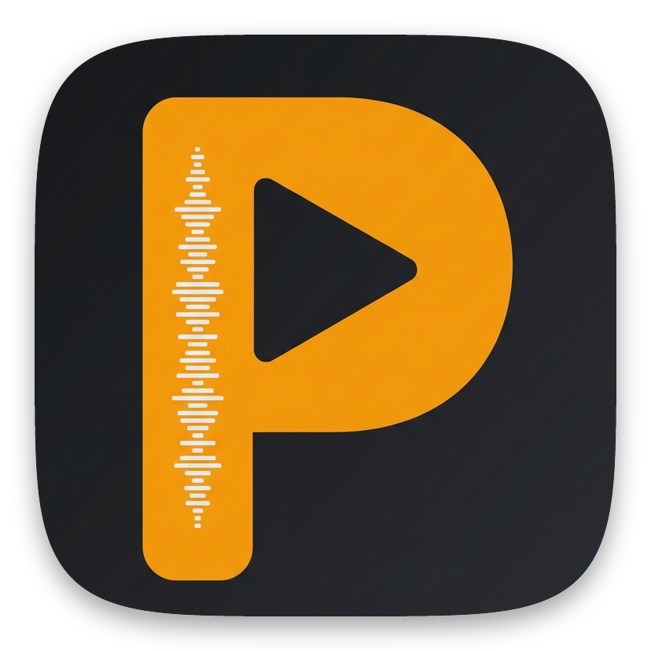
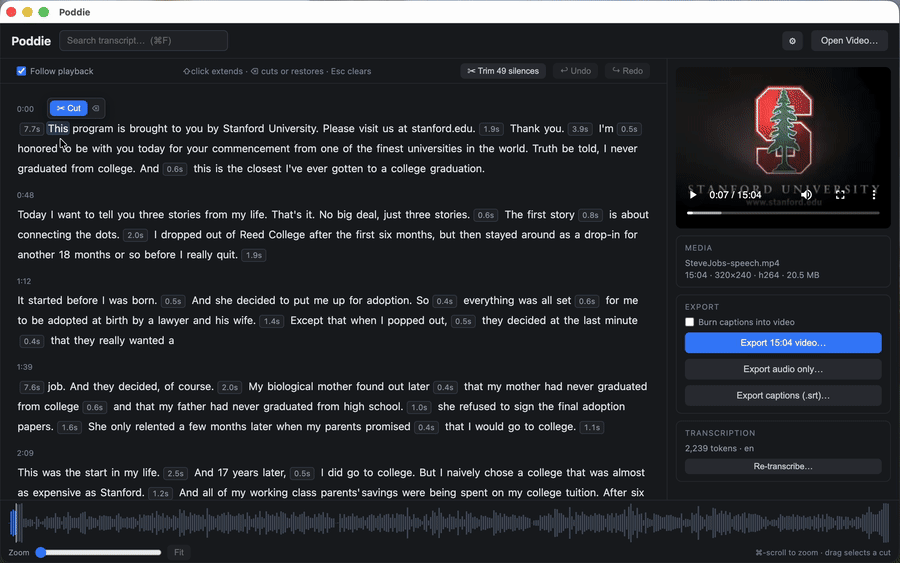

<div align="center">
  
  <h1>Poddie <sup>⎨beta⎬</sup></h1>
  <p><strong>Text-based, local-first video & podcast editor.</strong></p>
  <p><em>Cut video or audio by deleting words — local, private, and free, all on your Mac.</em></p>
</div>

<div align="center">

**🔒 100% local & private** · **💸 Free transcription** · **🔇 Silence auto-trim** · **📑 AI chapter curation** · **💬 Caption burn-in**



</div>

---

Poddie turns podcast editing into text editing. Import a recording — video or
audio-only — get a word-level transcript, then **delete the words you don't want**,
and Poddie cuts the media to match. What takes an hour of timeline scrubbing now takes minutes of proofreading.

Built for podcasters and creators who don't have time to edit their footage.

- 🎙️ **Transcribe free & offline** with a local Whisper model — or use OpenAI's API
  (~$0.006/min) when you want it faster.
- ✂️ **Edit by deleting words** — select words or silences, hit delete, done. Full undo/redo.
- 🔇 **Silence auto-trim** — strip dead air across the whole episode in one click, no
  hunting for gaps.
- ▶️ **Preview instantly** — the player skips your cuts live, no re-encoding, with a
  zoomable waveform for frame-precise selections.
- ✂️ **Filler word removal** — one-click removal of filler words (currently supports EN & CN) across
  the entire episode.
- 💬 **Caption burn-in** — generate captions from your transcript and burn them straight
  into the video.
- 📑 **AI chapter curation** — a local LLM breaks your episode into story-arc chapters with editorial verdicts, so you decide what to keep or cut
  at the chapter level before word-level editing. Runs entirely on your machine. Works with any Ollama-compatible model (default: Qwen3 8B).
- 📤 **Export anything** — cut video (MP4), audio-only podcast (M4A/MP3), or captions as a
  standalone SRT file.

No lock-in, no hidden database, no cloud.

> **Beta / personal tool.** Poddie was built for one person's podcast workflow and tested
> on **macOS only**. Expect rough edges,
> and see [Known limitations](#known-limitations) before relying on it.

---

## Requirements

| Requirement | Notes |
|-------------|-------|
| **macOS** (Apple Silicon or Intel) | Distributed as a universal build. Uses `h264_videotoolbox` with a `libx264` software fallback, and probes both Homebrew prefixes (`/opt/homebrew` on Apple Silicon, `/usr/local` on Intel). Best-tested on Apple Silicon. |
| **Node.js 22+** and npm | To run or build from source. |
| **ffmpeg** | `brew install ffmpeg-full` recommended — the standard `ffmpeg` bottle works but lacks `libass`, so caption **burn-in** is disabled (SRT export still works). |
| **whisper.cpp** *(optional)* | `brew install whisper-cpp` — only needed for the free local transcription engine. Without it, the OpenAI API engine still works. |
| **Ollama** *(optional)* | [Install Ollama](https://ollama.com) and `ollama pull qwen3:8b` — only needed for AI chapter curation. Without it, transcription and filler removal still work. |
| **OpenAI API key** *(optional)* | Only needed for the API transcription engine. Set `OPENAI_API_KEY`, or enter it once in the app. |

> Poddie shells out to system `ffmpeg`/`ffprobe`/`whisper-cli` and talks to Ollama over
> HTTP (it does not bundle any of them), preferring the `ffmpeg-full` keg (either Homebrew
> prefix), then `/opt/homebrew/bin` → `/usr/local/bin` → `PATH`, health-checking each.
> Override with `PODDIE_FFMPEG`, `PODDIE_FFPROBE`, `PODDIE_WHISPER_CLI`,
> `PODDIE_OLLAMA_URL` (default `http://127.0.0.1:11434`), or `PODDIE_LLM_MODEL`
> (default `qwen3:8b` — any Ollama-compatible model works; see
> [Using a different LLM](#using-a-different-llm)).

---

## Install & run from source

```bash
git clone https://github.com/SinanTang/poddie.git
cd poddie
npm install
npm run dev
```

Optionally create a `.env` in the repo root so the app picks up your API key in dev:

```
OPENAI_API_KEY=sk-...
```

## Build a distributable app

```bash
npm run dist:dir   # unpacked universal Poddie.app in dist/mac-universal/ (try this first)
npm run dist       # a universal .dmg in dist/
```

The build is **ad-hoc signed, not notarized**. The first time you
open it, macOS Gatekeeper will warn about an "unidentified developer" — right-click the
app → Open, then confirm.

---

## How to use

1. **Open Media…** — pick a video (`.mov`/`.mp4`/`.m4v`) or audio file (`.m4a`/`.mp3`/`.wav`/`.flac`/`.ogg`/`.opus`/`.aac`).
   iPhone HEVC is auto-converted to an H.264 preview proxy, and audio Chromium can't play
   (e.g. ALAC) to an AAC one.
2. **Choose how to transcribe** in the header — **Local model** (free, private, no key) or
   **OpenAI API** (paste your key). Local's first run downloads a ~1.6 GB Whisper model once. You'll
   see a cost/time estimate and confirm.
3. **Curate chapters** *(optional, requires Ollama)* — click **📑 Chapters** to have a local
   LLM break the episode into story-arc chapters with editorial verdicts. Toggle subchapters
   to keep or cut, then **Apply cuts** to remove them all at once.
4. **Edit** — click a word to seek; drag or shift-click to select, then <kbd>⌫</kbd> to cut
   (press again on a fully-cut selection to restore). Double-click a word to fix its text.
   Use **✂ Trim silences** to bulk-remove dead air.
5. **Preview** — the player skips your cuts live. Zoom the waveform for precise selections.
6. **Export** the cut video, audio-only, or captions. (Audio sources offer audio and captions only.)

Keyboard: <kbd>Space</kbd> play/pause · <kbd>←</kbd>/<kbd>→</kbd> ±3s ·
<kbd>⌘F</kbd> search · <kbd>⌘Z</kbd>/<kbd>⇧⌘Z</kbd> undo/redo.

---

## Where your files live

- **Your edits** are saved as a sidecar next to the source video:
  `<video>.poddie.json` (API engine) and `<video>.poddie.local.json` (local engine).
  Each engine keeps its own file, so switching engines swaps transcript + edits without
  losing either. These files are plain JSON — readable, diffable, no hidden database.
- **App data** (preview proxies, waveform peaks, extracted audio, downloaded Whisper models,
  logs, and your saved API key) lives in `~/Library/Application Support/poddie/`.

Two things to know:

- **Keep the video where it is.** The sidecar is tied to the video's path — move or rename
  the video and its project file is orphaned. If you move the video, move its `.poddie*.json`
  files alongside it.
- **The video's folder must be writable** for edits to save. A video opened from a read-only
  location (mounted DMG, locked SD card) will transcribe but fail to save a project.

---

## Contributing

Poddie is an Electron + Vite + React + TypeScript app. Main process (Node/ffmpeg/fs),
preload bridge, and renderer (React UI) live under `src/`.

```bash
npm run dev        # run in development (hot reload)
npm test           # unit tests (Vitest)
npm run typecheck  # tsc --noEmit
npm run lint       # eslint
```

- **Architecture & conventions:** [`CLAUDE.md`](CLAUDE.md) explains the core edit model
  (non-destructive `EditItem` / `keptRanges`), the media-serving approach, and the
  packaging gotchas.
- **Design decisions & history:** [`docs/development/`](docs/development/) records every
  architecture decision.
- Keep business logic as pure, unit-tested functions (see `src/shared/`).

Please open an issue to discuss substantial changes before a PR.

---

## Using a different LLM

Poddie's AI features (chapter curation) use [Ollama](https://ollama.com) with **Qwen3 8B**
by default. You can swap in any Ollama-compatible model.

**From source** (env vars or `.env` file):

```bash
ollama pull llama3.1:8b
PODDIE_LLM_MODEL=llama3.1:8b npm run dev
```

**Built app** (edit `~/Library/Application Support/poddie/config.json`):

```json
{
  "llmModel": "llama3.1:8b",
  "ollamaUrl": "http://127.0.0.1:11434"
}
```

Both fields are optional — omit either to keep the default. Env vars (`PODDIE_LLM_MODEL`,
`PODDIE_OLLAMA_URL`) always override the config file when set.

**What the model needs to do well:**
- Follow a JSON schema (Ollama's `format` parameter enforces structure, but the model must
  produce coherent field values)
- Handle long inputs (~10k–20k tokens for a 44-minute transcript at 32k context)
- Generate text in the transcript's language (multilingual models work best)

Tested models: `qwen3:8b` (default, good multilingual coverage). Larger models (13B+)
may produce better editorial verdicts but need more RAM and run slower. The 4B class
is not recommended — spike testing showed intermittent degenerate outputs.

---

## Known limitations

- **macOS only.** Universal build runs on Apple Silicon and Intel; no Windows/Linux. Best-tested on Apple Silicon.
- **Depends on Homebrew tools** — `ffmpeg`/`whisper-cli` are not bundled; other users must
  install them (see [Requirements](#requirements)).
- Tuned for iPhone H.264/HEVC recordings; exotic codecs are untested.

---

## License

Poddie is licensed under the GNU General Public License v3.0 or later.
See [LICENSE](LICENSE) for the full license text.
